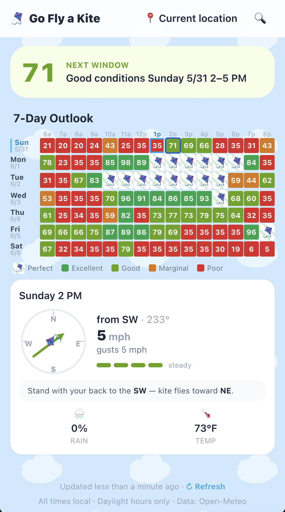

# 🪁 Kite — "When can I fly?"

**▶︎ Live: https://christianalexa.github.io/Kite/**

A small installable PWA that tells casual kite flyers **when the wind is actually
good**. It pulls the local hourly forecast, scores every daytime hour 0–100 for
kite-flying quality, and surfaces the next good window in plain language — e.g.
_"Excellent conditions Tuesday 3–6 PM"_ — plus a tap-to-drill 7-day heatmap.

<p align="center">
  
</p>

## Run

```bash
npm install
npm run dev        # http://localhost:5173
npm test           # Vitest (66 tests)
npm run build      # static bundle → dist/
```

## Deploy

Static, no backend. On Vercel/Netlify: build `npm run build`, output `dist/`.

## How it scores

Weighted sum of wind (0.45), gust steadiness (0.35), precip (0.15), and temp
(0.05), with hard gates that drop calm, wet, or turbulent hours to Poor. Full
model in [`src/lib/scoring.js`](src/lib/scoring.js); design notes in
[`docs/SPEC.md`](docs/SPEC.md).

## Stack & privacy

React + Vite + Tailwind. Weather from the free, keyless
[Open-Meteo](https://open-meteo.com/) API, plus live station observations from
the [U.S. National Weather Service](https://api.weather.gov/) — both called
straight from the browser. Last location and station choice are kept in
`localStorage`; no accounts, no analytics, no tracking ([PRIVACY.md](PRIVACY.md)).

> `npm audit` shows moderate advisories in the dev-only Vite/esbuild toolchain —
> not in the shipped bundle.

## License

[MIT](LICENSE) © 2026 Christian Alexa
